# Cloud Setup & Deployment Guide

This guide covers METRO Digital's three-environment deployment architecture for Creative Studio on Google Cloud Platform.

## Environment Structure

Your repository is configured for **three independent GCP projects**, each mapped to a git branch:

| Environment | GCP Project ID | Git Branch | Region | Purpose |
|-------------|----------------|-----------|--------|---------|
| **Development** | `cf-genaistudi-genai-studio--gv` | `develop` | europe-west3 | Active development & testing |
| **Pre-Production** | `cf-genaistudi-genai-studio--vm` | `test` | europe-west3 | Final validation before prod |
| **Production** | `cf-genaistudi-genai-studio--7u` | `main` | europe-west3 | Live end-user environment |

## Architecture Diagram

```mermaid
graph TB
    subgraph Dev ["Development (develop branch)"]
        D_IAP["IAP<br/>email: *@metro.digital"]
        D_FE["Frontend Cloud Run<br/>cstudio-frontend-dev"]
        D_BE["Backend Cloud Run<br/>cstudio-backend-dev"]
        D_DB["Cloud SQL<br/>PostgreSQL"]
        D_IAP -->|HTTPS| D_FE
        D_IAP -->|/api/*| D_BE
        D_FE -.->|API calls| D_BE
        D_BE -->|queries| D_DB
    end

    subgraph PP ["Pre-Production (test branch)"]
        PP_IAP["IAP<br/>email: *@metro.digital"]
        PP_FE["Frontend Cloud Run<br/>cstudio-frontend-pp"]
        PP_BE["Backend Cloud Run<br/>cstudio-backend-pp"]
        PP_DB["Cloud SQL<br/>PostgreSQL"]
        PP_IAP -->|HTTPS| PP_FE
        PP_IAP -->|/api/*| PP_BE
        PP_FE -.->|API calls| PP_BE
        PP_BE -->|queries| PP_DB
    end

    subgraph Prod ["Production (main branch)"]
        P_IAP["IAP<br/>email: *@metro.digital"]
        P_FE["Frontend Cloud Run<br/>cstudio-frontend-prod"]
        P_BE["Backend Cloud Run<br/>cstudio-backend-prod"]
        P_DB["Cloud SQL<br/>PostgreSQL"]
        P_IAP -->|HTTPS| P_FE
        P_IAP -->|/api/*| P_BE
        P_FE -.->|API calls| P_BE
        P_BE -->|queries| P_DB
    end

    Users["METRO Users<br/>@metro.digital<br/>@metro-gsc.in"]
    Users -->|login| Dev
    Users -->|login| PP
    Users -->|login| Prod

    style Dev fill:#e3f2fd
    style PP fill:#fff3e0
    style Prod fill:#f3e5f5
```



## Prerequisites

Before deploying, ensure you have:

1. **Access to GCP Projects**
   - Organization SSO login to all three projects
   - No service account keys (use Workload Identity Federation)

2. **Local Tools**
   - `gcloud` CLI (latest)
   - `terraform` >= 1.5
   - `git` with SSH keys configured

3. **Permissions**
   - At least one GCP admin to run `infra/setup-terraform-service-accounts.sh`
   - Or specific IAM roles listed in [DEPLOYMENT_REQUIRED_PERMISSIONS.md](DEPLOYMENT_REQUIRED_PERMISSIONS.md)

4. **Repository Setup**
   - Forked into METRO GitHub: `metro-digital-inner-source/gcc-creative-studio`
   - Branch protection on `main` (pull requests required)
   - GitHub Actions secrets configured (see **CI/CD Setup** below)

## Deployment Architecture: Infrastructure & Services

Each environment runs:

- **Frontend Cloud Run** (SSR via Node.js + Express)
  - Serves Angular application via nginx
  - Port 3000 (internal), exposed via HTTPS Load Balancer
  - Managed via Terraform (src: `infra/modules/cloud_run.tf`)

- **Backend Cloud Run** (FastAPI)
  - REST API endpoints (`/api/*`)
  - Health checks `/health`
  - Port 8000 (internal), exposed via same HTTPS Load Balancer
  - Managed via Terraform (src: `infra/modules/cloud_run.tf`)

- **Cloud SQL** (PostgreSQL 15+)
  - Private IP (vpc-connector)
  - Automated backups (7-day retention)
  - Alembic migrations (auto-applied on first deploy)
  - Managed via Terraform (src: `infra/modules/cloudsql.tf`)

- **HTTPS Load Balancer + IAP**
  - Single domain for both frontend & backend
  - URL map routes `/*` → frontend, `/api/*` → backend
  - Identity-Aware Proxy enforces email domain

## Step-by-Step Deployment

### Step 1: Set Up Service Accounts (Terraform Deployer)

Your GCP admin must run the setup script **once per project**:

```bash
# Run from the repo root
./infra/setup-terraform-service-accounts.sh
```

This creates:
- `terraform-deployer` service account in each project
- Granular IAM roles (no primitive roles)
- Terraform state bucket (GCS)
- Outputs service account emails for GitHub Actions setup

**Alternative:** Request the exact roles from [DEPLOYMENT_REQUIRED_PERMISSIONS.md](DEPLOYMENT_REQUIRED_PERMISSIONS.md).

### Step 2: Configure GitHub Actions (WIF)

After service accounts are set up, record the **service account emails** from the setup script output:

```
Dev:  terraform-deployer@cf-genaistudi-genai-studio--gv.iam.gserviceaccount.com
PP:   terraform-deployer@cf-genaistudi-genai-studio--vm.iam.gserviceaccount.com
Prod: terraform-deployer@cf-genaistudi-genai-studio--7u.iam.gserviceaccount.com
```

**Create Workload Identity Pool & Provider** (one-time):

```bash
# Set these to your organization
ORG=metro-digital-inner-source
REPO=gcc-creative-studio

# Create pool
gcloud iam workload-identity-pools create "github-pool" \
  --project=PROJECT_ID \
  --location=global \
  --display-name="GitHub Actions"

# Create provider
gcloud iam workload-identity-pools providers create-oidc "github-provider" \
  --project=PROJECT_ID \
  --location=global \
  --workload-identity-pool="github-pool" \
  --display-name="GitHub" \
  --attribute-mapping="google.subject=assertion.sub,assertion.aud=assertion.aud" \
  --issuer-uri="https://token.actions.githubusercontent.com" \
  --attribute-condition="assertion.aud == 'sts.amazonaws.com' && assertion.repository == '${ORG}/${REPO}'"

# Grant service account impersonation rights
gcloud iam service-accounts add-iam-policy-binding \
  terraform-deployer@cf-genaistudi-genai-studio--gv.iam.gserviceaccount.com \
  --project=cf-genaistudi-genai-studio--gv \
  --role=roles/iam.workloadIdentityUser \
  --member="principalSet://iam.googleapis.com/projects/PROJECT_NUMBER/locations/global/workloadIdentityPools/github-pool/attribute.repository/${ORG}/${REPO}"
```

**GitHub Actions Already Configured:** `.github/workflows/terraform.yml` uses WIF automatically.

### Step 3: Deploy Terraform (Dev Environment First)

Deploy development as your "canary" environment:

```bash
# Navigate to dev environment
cd infra/environments/dev

# Initialize Terraform (downloads providers, sets up state bucket)
terraform init

# Plan the deployment (review changes)
terraform plan -var-file=dev.tfvars -out=tfplan

# Apply the changes (creates GCP resources)
terraform apply tfplan
```

**What Gets Created:**
- Cloud SQL PostgreSQL instance
- VPC + VPC Connector (for Cloud Run to reach Cloud SQL)
- Artifact Registry (for container images)
- Cloud Run services (frontend + backend)
- HTTPS Load Balancer + Backend Services
- Service accounts for Cloud Run (least-privilege)
- Cloud Build triggers (auto-deploy on git push)

**Expected Duration:** 15-20 minutes for first apply.

### Step 4: Build & Push Container Images

Cloud Build automatically builds containers when you push code, or manually trigger:

```bash
# Trigger backend build
gcloud builds submit \
  --project=cf-genaistudi-genai-studio--gv \
  --config=backend/cloudbuild.yaml \
  --substitutions=COMMIT_SHA=$(git rev-parse HEAD),BRANCH_NAME=develop

# Trigger frontend build
gcloud builds submit \
  --project=cf-genaistudi-genai-studio--gv \
  --config=frontend/cloudbuild.yaml \
  --substitutions=COMMIT_SHA=$(git rev-parse HEAD),BRANCH_NAME=develop
```

Images are pushed to: `europe-west3-docker.pkg.dev/cf-genaistudi-genai-studio--gv/creative-studio/`

### Step 5: Deploy Backend Service

After containers are built, deploy to Cloud Run:

```bash
gcloud run deploy cstudio-backend-dev \
  --project=cf-genaistudi-genai-studio--gv \
  --region=europe-west3 \
  --image=europe-west3-docker.pkg.dev/cf-genaistudi-genai-studio--gv/creative-studio/backend:develop-COMMIT_SHA \
  --set-env-vars=ENVIRONMENT=development,ALLOWED_EMAILS=""
```

**Verify:**
```bash
gcloud run services describe cstudio-backend-dev \
  --project=cf-genaistudi-genai-studio--gv \
  --region=europe-west3
```

### Step 6: Configure IAP (Email Domain Restriction)

In Cloud Console:
1. Navigate to **Security > Identity-Aware Proxy**
2. Select your backend service
3. Click **Add Access**
4. Grant role `IAP-Secured Web App User` to:
   - `serviceAccounts/` (if using service accounts)
   - Or specific email groups: `@metro.digital`, `@metro-gsc.in`

### Step 7: Bootstrap Database

After Cloud Run services are running:

```bash
# From repo root
./bootstrap.sh

# The script will:
# - Detect environment (GCP project)
# - Create Firebase projects (if needed)
# - Run Alembic migrations
# - Seed default groups (AI Enabler, etc.)
# - Create default admin user
```

**If Bootstrap Fails:**
```bash
# Manually run migrations
gcloud sql connect creative-studio-db-HASH \
  --project=cf-genaistudi-genai-studio--gv \
  --user=postgres \
  --database=genaistudio

# Then inside psql:
# \i backend/alembic/versions/LATEST_MIGRATION.sql
```

### Step 8: Repeat for Pre-Production & Production

Once Dev is stable, repeat Steps 3-7 for:

```bash
# Pre-Production (test branch)
cd infra/environments/pp
terraform init && terraform plan -var-file=pp.tfvars && terraform apply -var-file=pp.tfvars

# Production (main branch) - after thorough testing
cd infra/environments/prod
terraform init && terraform plan -var-file=prod.tfvars && terraform apply -var-file=prod.tfvars
```

## Verification Checklist

After deployment, verify everything is working:

### Backend Verification

```bash
# 1. Check Cloud Run service is running
gcloud run services describe cstudio-backend-dev \
  --project=cf-genaistudi-genai-studio--gv \
  --region=europe-west3

# 2. Test backend health endpoint
curl https://cstudio-backend-dev-HASH-europe-west3.a.run.app/health

# 3. Check logs for errors
gcloud run services logs read cstudio-backend-dev \
  --project=cf-genaistudi-genai-studio--gv \
  --region=europe-west3 \
  --limit=50

# 4. Verify database connection (from your machine)
gcloud sql connect creative-studio-db-HASH \
  --project=cf-genaistudi-genai-studio--gv \
  --user=postgres \
  --database=genaistudio -c "SELECT version();"
```

### Frontend Verification

```bash
# 1. Check Cloud Run service is running
gcloud run services describe cstudio-frontend-dev \
  --project=cf-genaistudi-genai-studio--gv \
  --region=europe-west3

# 2. Access via browser (or curl if IAP is configured)
# https://cstudio-dev.metro.digital/

# 3. Check service logs
gcloud run services logs read cstudio-frontend-dev \
  --project=cf-genaistudi-genai-studio--gv \
  --region=europe-west3 \
  --limit=50
```

### Database Verification

```bash
# 1. List tables
gcloud sql connect creative-studio-db-HASH \
  --project=cf-genaistudi-genai-studio--gv \
  --user=postgres \
  --database=genaistudio -c "\dt"

# 2. Check migration history
gcloud sql connect creative-studio-db-HASH \
  --project=cf-genaistudi-genai-studio--gv \
  --user=postgres \
  --database=genaistudio -c "SELECT * FROM alembic_version LIMIT 10;"

# 3. Verify default groups were created
gcloud sql connect creative-studio-db-HASH \
  --project=cf-genaistudi-genai-studio--gv \
  --user=postgres \
  --database=genaistudio -c "SELECT id, name FROM \"group\" LIMIT 10;"
```

## Rollback Procedures

### Rollback Backend Service

```bash
# 1. Get previous revision
gcloud run revisions list \
  --service=cstudio-backend-dev \
  --project=cf-genaistudi-genai-studio--gv \
  --region=europe-west3

# 2. Route traffic to previous revision
gcloud run services update-traffic cstudio-backend-dev \
  --project=cf-genaistudi-genai-studio--gv \
  --region=europe-west3 \
  --to-revisions=PREVIOUS_REVISION_ID=100
```

### Rollback Database (Migrations)

```bash
# 1. Stop the application (to prevent migrations during rollback)
gcloud run services update cstudio-backend-dev \
  --project=cf-genaistudi-genai-studio--gv \
  --region=europe-west3 \
  --no-traffic

# 2. Revert migration
gcloud sql connect creative-studio-db-HASH \
  --project=cf-genaistudi-genai-studio--gv \
  --user=postgres \
  --database=genaistudio

# Inside psql, run downgrade script (if available)
# \i backend/alembic/versions/PREVIOUS_MIGRATION.down.sql

# 3. Restart service with previous code
git checkout PREVIOUS_COMMIT
# ... rebuild and redeploy
```

### Rollback Infrastructure (Terraform)

```bash
# 1. Get previous state
cd infra/environments/dev
terraform state list

# 2. Review what will be destroyed
terraform plan -destroy -var-file=dev.tfvars

# 3. Only if absolutely necessary (destructive!)
terraform destroy -var-file=dev.tfvars
```

**⚠️ WARNING:** `terraform destroy` will delete Cloud SQL databases, load balancers, and all deployed resources. Only use in dev environment for fresh start.

## Production Deployment Checklist

Before deploying to **production** (main branch):

- [ ] All tests pass locally (`pytest`, `npm test`)
- [ ] Feature branch merged to `test` and validated in PP environment
- [ ] Database migrations tested on prod-like schema (run on PP first)
- [ ] Deployment requires code review + approval (PR)
- [ ] Incident response plan reviewed (on-call schedule)
- [ ] Monitoring & alerts configured (Datadog, Cloud Logging)
- [ ] Runbook documented for incident response
- [ ] Team notified of deployment window (if infrastructure changes)

## CI/CD Pipeline

GitHub Actions automatically deploys on git push:

**Branch → Environment Mapping:**
- Push to `develop` → Deploys to Dev
- Push to `test` → Deploys to Pre-Production
- Push to `main` → Deploys to Production (requires PR approval)

**Pipeline Steps:**
1. Run tests (backend pytest, frontend npm test)
2. Build containers (Cloud Build)
3. Push to Artifact Registry
4. Update Cloud Run service
5. Run smoke tests (basic health checks)
6. Notify Slack (on success/failure)

## Team Escalation & Support

| Issue | Contact | Action |
|-------|---------|--------|
| **Database connection error** | GCP Admin / Cloud SQL team | Check VPC Connector status, review quota |
| **IAP authentication fails** | Identity & Access team | Verify email domain in IAP policy, check OAuth client ID |
| **Cloud Run OOM/timeout** | Backend team | Increase memory/timeout, optimize queries |
| **Terraform state lock** | DevOps team | `terraform force-unlock LOCK_ID` |
| **Production incident** | On-call engineer | Initiate incident response, document in runbook |

**Escalation:** If blocked, contact the METRO Platform team with:
- Environment (dev/pp/prod)
- Error message + logs
- Steps taken so far

## Next Steps

1. ✅ **Run setup script** → Create service accounts
2. ✅ **Deploy to dev** → Test infrastructure & deployment process
3. ✅ **Configure GitHub Actions** → Set up WIF for automation
4. ✅ **Validate in PP** → Test with real authentication before prod
5. ✅ **Deploy to prod** → Follow all PR review & monitoring checklist

For more help, see:
- [DEVELOPMENT.md](DEVELOPMENT.md) — Local development
- [DEPLOYMENT_REQUIRED_PERMISSIONS.md](DEPLOYMENT_REQUIRED_PERMISSIONS.md) — IAM roles
- [docs/TROUBLESHOOTING.md](docs/TROUBLESHOOTING.md) — Common issues
